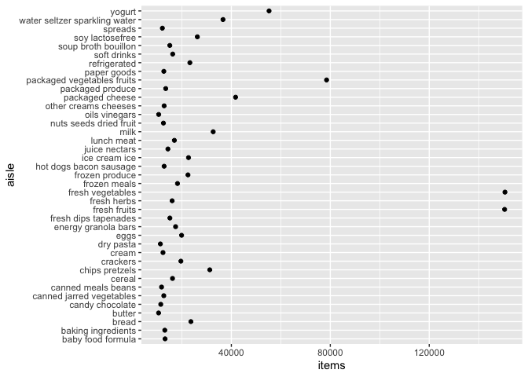
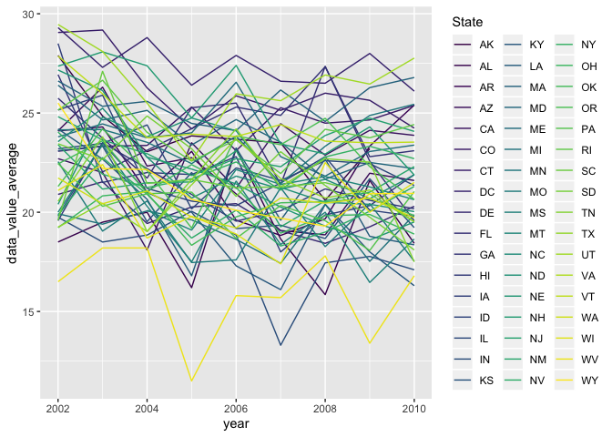

HW 3
================
Xing Chen
2019-10-12

# Problem 1

## 

``` r
data("instacart")
instacart %>% 
  group_by(aisle) %>% 
  summarize(items = n()) %>% 
  arrange(desc(items))
```

    ## # A tibble: 134 x 2
    ##    aisle                          items
    ##    <chr>                          <int>
    ##  1 fresh vegetables              150609
    ##  2 fresh fruits                  150473
    ##  3 packaged vegetables fruits     78493
    ##  4 yogurt                         55240
    ##  5 packaged cheese                41699
    ##  6 water seltzer sparkling water  36617
    ##  7 milk                           32644
    ##  8 chips pretzels                 31269
    ##  9 soy lactosefree                26240
    ## 10 bread                          23635
    ## # … with 124 more rows

## 

``` r
instacart %>% 
  group_by(aisle) %>% 
  summarize(items = n()) %>% 
  filter(items > 10000) %>% 
  ggplot(aes(x = items, y = aisle)) + 
  geom_point()
```

<!-- -->
(how to make the plot readable?)

## create a table showing the three most popular items

``` r
instacart %>% 
  group_by(aisle) %>% 
  summarize(items = n()) %>% 
  filter(min_rank(desc(items)) < 4) %>% 
  knitr::kable()
```

| aisle                      |  items |
| :------------------------- | -----: |
| fresh fruits               | 150473 |
| fresh vegetables           | 150609 |
| packaged vegetables fruits |  78493 |

## a table showing the mean hour

``` r
instacart %>% 
  group_by(product_name, order_dow) %>% 
  filter(product_name %in% c("Pink Lady Apples", "Coffee Ice Cream")) %>% 
  summarize(
    mean_order_time = mean(order_hour_of_day, na.rm = TRUE)
  ) %>% 
  pivot_wider(
    names_from = order_dow,
    values_from = mean_order_time
  ) %>% 
  knitr::kable()
```

| product\_name    |        0 |        1 |        2 |        3 |        4 |        5 |        6 |
| :--------------- | -------: | -------: | -------: | -------: | -------: | -------: | -------: |
| Coffee Ice Cream | 13.77419 | 14.31579 | 15.38095 | 15.31818 | 15.21739 | 12.26316 | 13.83333 |
| Pink Lady Apples | 13.44118 | 11.36000 | 11.70213 | 14.25000 | 11.55172 | 12.78431 | 11.93750 |

# problem 2

## Data import and data cleaning

``` r
data("brfss_smart2010")

brfss_data = 
  brfss_smart2010 %>% 
  janitor::clean_names() %>% 
  filter(
    topic == "Overall Health", 
    response %in% c("Poor", "Fair", "Good", "Very good", "Excellent")
  ) %>% 
  mutate(
    response = factor(response),
    response = fct_relevel(response, "Poor", "Fair", "Good", "Very good", "Excellent")
  )
```

## states were observed at 7 or more locations in 2002 and 2010

``` r
brfss_data %>% 
  filter(
    year %in% c(2002, 2010)
  ) %>% 
  group_by(year, locationabbr) %>% 
  summarize(
    unique_location = n_distinct(locationdesc)
  ) %>% 
  filter(unique_location > 6) %>% 
knitr::kable()
```

| year | locationabbr | unique\_location |
| ---: | :----------- | ---------------: |
| 2002 | CT           |                7 |
| 2002 | FL           |                7 |
| 2002 | MA           |                8 |
| 2002 | NC           |                7 |
| 2002 | NJ           |                8 |
| 2002 | PA           |               10 |
| 2010 | CA           |               12 |
| 2010 | CO           |                7 |
| 2010 | FL           |               41 |
| 2010 | MA           |                9 |
| 2010 | MD           |               12 |
| 2010 | NC           |               12 |
| 2010 | NE           |               10 |
| 2010 | NJ           |               19 |
| 2010 | NY           |                9 |
| 2010 | OH           |                8 |
| 2010 | PA           |                7 |
| 2010 | SC           |                7 |
| 2010 | TX           |               16 |
| 2010 | WA           |               10 |

## create a new dataset and make a “spaghetti” plot

``` r
brfss_excellent = 
  brfss_data %>% 
  filter(response == "Excellent") %>% 
  group_by(locationabbr, year) %>% 
  mutate(
    data_value_average = mean(data_value, na.rm = TRUE)) %>% 
  select(year, locationabbr, data_value_average) %>% 
  distinct()

brfss_excellent %>% 
  ggplot(aes(x = year, y = data_value_average, color = locationabbr)) +
  geom_line() +
  viridis::scale_color_viridis(
    name = "State", 
    discrete = TRUE
  )
```

<!-- -->
