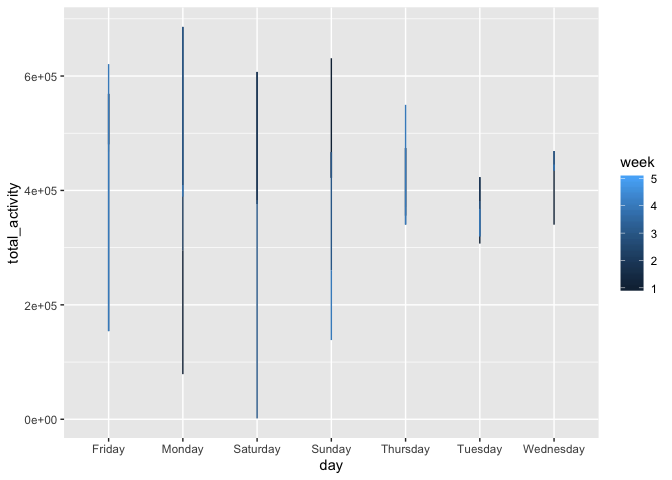

HW 3
================
Xing Chen
2019-10-12

# Problem 1

## 

``` r
data("instacart")
instacart %>% 
  group_by(aisle) %>% 
  summarize(items = n()) %>% 
  arrange(desc(items))
```

    ## # A tibble: 134 x 2
    ##    aisle                          items
    ##    <chr>                          <int>
    ##  1 fresh vegetables              150609
    ##  2 fresh fruits                  150473
    ##  3 packaged vegetables fruits     78493
    ##  4 yogurt                         55240
    ##  5 packaged cheese                41699
    ##  6 water seltzer sparkling water  36617
    ##  7 milk                           32644
    ##  8 chips pretzels                 31269
    ##  9 soy lactosefree                26240
    ## 10 bread                          23635
    ## # … with 124 more rows

## 

``` r
instacart %>% 
  group_by(aisle) %>% 
  summarize(items = n()) %>% 
  filter(items > 10000) %>% 
  ggplot(aes(x = items, y = aisle)) + 
  geom_point()
```

<!-- -->
(how to make the plot readable?)

## create a table showing the three most popular items

``` r
instacart %>% 
  group_by(aisle) %>% 
  summarize(items = n()) %>% 
  filter(min_rank(desc(items)) < 4) %>% 
  knitr::kable()
```

| aisle                      |  items |
| :------------------------- | -----: |
| fresh fruits               | 150473 |
| fresh vegetables           | 150609 |
| packaged vegetables fruits |  78493 |

## a table showing the mean hour

``` r
instacart %>% 
  group_by(product_name, order_dow) %>% 
  filter(product_name %in% c("Pink Lady Apples", "Coffee Ice Cream")) %>% 
  summarize(
    mean_order_time = mean(order_hour_of_day, na.rm = TRUE)
  ) %>% 
  pivot_wider(
    names_from = order_dow,
    values_from = mean_order_time
  ) %>% 
  knitr::kable()
```

| product\_name    |        0 |        1 |        2 |        3 |        4 |        5 |        6 |
| :--------------- | -------: | -------: | -------: | -------: | -------: | -------: | -------: |
| Coffee Ice Cream | 13.77419 | 14.31579 | 15.38095 | 15.31818 | 15.21739 | 12.26316 | 13.83333 |
| Pink Lady Apples | 13.44118 | 11.36000 | 11.70213 | 14.25000 | 11.55172 | 12.78431 | 11.93750 |

# problem 2

## Data import and data cleaning

``` r
data("brfss_smart2010")

brfss_data = 
  brfss_smart2010 %>% 
  janitor::clean_names() %>% 
  filter(
    topic == "Overall Health", 
    response %in% c("Poor", "Fair", "Good", "Very good", "Excellent")
  ) %>% 
  mutate(
    response = factor(response),
    response = fct_relevel(response, "Poor", "Fair", "Good", "Very good", "Excellent")
  )
```

## states were observed at 7 or more locations in 2002 and 2010

``` r
brfss_data %>% 
  filter(
    year %in% c(2002, 2010)
  ) %>% 
  group_by(year, locationabbr) %>% 
  summarize(
    unique_location = n_distinct(locationdesc)
  ) %>% 
  filter(unique_location > 6) %>% 
knitr::kable()
```

| year | locationabbr | unique\_location |
| ---: | :----------- | ---------------: |
| 2002 | CT           |                7 |
| 2002 | FL           |                7 |
| 2002 | MA           |                8 |
| 2002 | NC           |                7 |
| 2002 | NJ           |                8 |
| 2002 | PA           |               10 |
| 2010 | CA           |               12 |
| 2010 | CO           |                7 |
| 2010 | FL           |               41 |
| 2010 | MA           |                9 |
| 2010 | MD           |               12 |
| 2010 | NC           |               12 |
| 2010 | NE           |               10 |
| 2010 | NJ           |               19 |
| 2010 | NY           |                9 |
| 2010 | OH           |                8 |
| 2010 | PA           |                7 |
| 2010 | SC           |                7 |
| 2010 | TX           |               16 |
| 2010 | WA           |               10 |

## create a new dataset and make a “spaghetti” plot

``` r
brfss_excellent = 
  brfss_data %>% 
  filter(response == "Excellent") %>% 
  group_by(locationabbr, year) %>% 
  mutate(
    data_value_average = mean(data_value, na.rm = TRUE)) %>% 
  select(year, locationabbr, data_value_average) %>% 
  distinct()

brfss_excellent %>% 
  ggplot(aes(x = year, y = data_value_average, color = locationabbr)) +
  geom_line() +
  viridis::scale_color_viridis(
    name = "State", 
    discrete = TRUE
  )
```

<!-- -->

## Make a two panel plot

``` r
brfss_data %>% 
  filter(year %in% c(2006, 2010), locationabbr == "NY") %>% 
  ggplot(aes(x = response, y = data_value)) +
  geom_violin() +
  facet_grid(~year)
```

<!-- -->

# Problem 3

## load and clean the data

``` r
accel_data = 
  read_csv(file = "./data/accel_data.csv") %>% 
  janitor::clean_names() %>% 
  mutate(
    day_type = ifelse(day %in% c("Saturday", "Sunday"), "weekend", "weekday")
  ) %>% 
  select(week, day_id, day, day_type, everything())
```

    ## Parsed with column specification:
    ## cols(
    ##   .default = col_double(),
    ##   day = col_character()
    ## )

    ## See spec(...) for full column specifications.

``` r
accel_data
```

    ## # A tibble: 35 x 1,444
    ##     week day_id day   day_type activity_1 activity_2 activity_3 activity_4
    ##    <dbl>  <dbl> <chr> <chr>         <dbl>      <dbl>      <dbl>      <dbl>
    ##  1     1      1 Frid… weekday        88.4       82.2       64.4       70.0
    ##  2     1      2 Mond… weekday         1          1          1          1  
    ##  3     1      3 Satu… weekend         1          1          1          1  
    ##  4     1      4 Sund… weekend         1          1          1          1  
    ##  5     1      5 Thur… weekday        47.4       48.8       46.9       35.8
    ##  6     1      6 Tues… weekday        64.8       59.5       73.7       45.7
    ##  7     1      7 Wedn… weekday        71.1      103.        68.5       45.4
    ##  8     2      8 Frid… weekday       675        542       1010        779  
    ##  9     2      9 Mond… weekday       291        335        393        335  
    ## 10     2     10 Satu… weekend        64         11          1          1  
    ## # … with 25 more rows, and 1,436 more variables: activity_5 <dbl>,
    ## #   activity_6 <dbl>, activity_7 <dbl>, activity_8 <dbl>,
    ## #   activity_9 <dbl>, activity_10 <dbl>, activity_11 <dbl>,
    ## #   activity_12 <dbl>, activity_13 <dbl>, activity_14 <dbl>,
    ## #   activity_15 <dbl>, activity_16 <dbl>, activity_17 <dbl>,
    ## #   activity_18 <dbl>, activity_19 <dbl>, activity_20 <dbl>,
    ## #   activity_21 <dbl>, activity_22 <dbl>, activity_23 <dbl>,
    ## #   activity_24 <dbl>, activity_25 <dbl>, activity_26 <dbl>,
    ## #   activity_27 <dbl>, activity_28 <dbl>, activity_29 <dbl>,
    ## #   activity_30 <dbl>, activity_31 <dbl>, activity_32 <dbl>,
    ## #   activity_33 <dbl>, activity_34 <dbl>, activity_35 <dbl>,
    ## #   activity_36 <dbl>, activity_37 <dbl>, activity_38 <dbl>,
    ## #   activity_39 <dbl>, activity_40 <dbl>, activity_41 <dbl>,
    ## #   activity_42 <dbl>, activity_43 <dbl>, activity_44 <dbl>,
    ## #   activity_45 <dbl>, activity_46 <dbl>, activity_47 <dbl>,
    ## #   activity_48 <dbl>, activity_49 <dbl>, activity_50 <dbl>,
    ## #   activity_51 <dbl>, activity_52 <dbl>, activity_53 <dbl>,
    ## #   activity_54 <dbl>, activity_55 <dbl>, activity_56 <dbl>,
    ## #   activity_57 <dbl>, activity_58 <dbl>, activity_59 <dbl>,
    ## #   activity_60 <dbl>, activity_61 <dbl>, activity_62 <dbl>,
    ## #   activity_63 <dbl>, activity_64 <dbl>, activity_65 <dbl>,
    ## #   activity_66 <dbl>, activity_67 <dbl>, activity_68 <dbl>,
    ## #   activity_69 <dbl>, activity_70 <dbl>, activity_71 <dbl>,
    ## #   activity_72 <dbl>, activity_73 <dbl>, activity_74 <dbl>,
    ## #   activity_75 <dbl>, activity_76 <dbl>, activity_77 <dbl>,
    ## #   activity_78 <dbl>, activity_79 <dbl>, activity_80 <dbl>,
    ## #   activity_81 <dbl>, activity_82 <dbl>, activity_83 <dbl>,
    ## #   activity_84 <dbl>, activity_85 <dbl>, activity_86 <dbl>,
    ## #   activity_87 <dbl>, activity_88 <dbl>, activity_89 <dbl>,
    ## #   activity_90 <dbl>, activity_91 <dbl>, activity_92 <dbl>,
    ## #   activity_93 <dbl>, activity_94 <dbl>, activity_95 <dbl>,
    ## #   activity_96 <dbl>, activity_97 <dbl>, activity_98 <dbl>,
    ## #   activity_99 <dbl>, activity_100 <dbl>, activity_101 <dbl>,
    ## #   activity_102 <dbl>, activity_103 <dbl>, activity_104 <dbl>, …

## 

``` r
accel_tidy_data = 
  accel_data %>% 
  pivot_longer(
    activity_1:activity_1440,
    names_to = "activity",
    values_to = "score") %>% 
  group_by(day_id) %>% 
  mutate(
    total_activity = sum(score))

accel_tidy_data %>% 
  pivot_wider(
    names_from = "activity",
    values_from = "score"
  ) %>% 
  select(day_id, day, total_activity) %>% 
  knitr::kable()
```

| day\_id | day       | total\_activity |
| ------: | :-------- | --------------: |
|       1 | Friday    |       480542.62 |
|       2 | Monday    |        78828.07 |
|       3 | Saturday  |       376254.00 |
|       4 | Sunday    |       631105.00 |
|       5 | Thursday  |       355923.64 |
|       6 | Tuesday   |       307094.24 |
|       7 | Wednesday |       340115.01 |
|       8 | Friday    |       568839.00 |
|       9 | Monday    |       295431.00 |
|      10 | Saturday  |       607175.00 |
|      11 | Sunday    |       422018.00 |
|      12 | Thursday  |       474048.00 |
|      13 | Tuesday   |       423245.00 |
|      14 | Wednesday |       440962.00 |
|      15 | Friday    |       467420.00 |
|      16 | Monday    |       685910.00 |
|      17 | Saturday  |       382928.00 |
|      18 | Sunday    |       467052.00 |
|      19 | Thursday  |       371230.00 |
|      20 | Tuesday   |       381507.00 |
|      21 | Wednesday |       468869.00 |
|      22 | Friday    |       154049.00 |
|      23 | Monday    |       409450.00 |
|      24 | Saturday  |         1440.00 |
|      25 | Sunday    |       260617.00 |
|      26 | Thursday  |       340291.00 |
|      27 | Tuesday   |       319568.00 |
|      28 | Wednesday |       434460.00 |
|      29 | Friday    |       620860.00 |
|      30 | Monday    |       389080.00 |
|      31 | Saturday  |         1440.00 |
|      32 | Sunday    |       138421.00 |
|      33 | Thursday  |       549658.00 |
|      34 | Tuesday   |       367824.00 |
|      35 | Wednesday |       445366.00 |

## 

``` r
accel_tidy_data %>% 
  group_by(week) %>% 
  ggplot(aes(x = day, y = total_activity, color = week)) +
  geom_line()
```

<!-- -->
