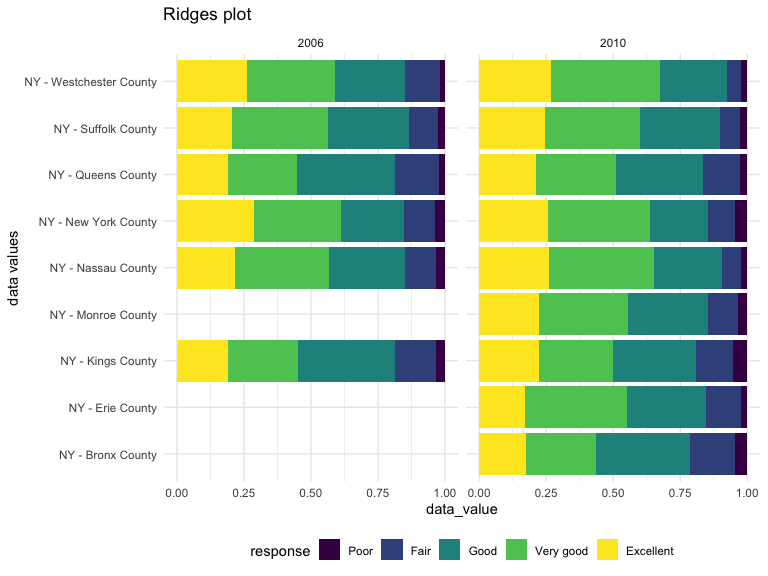
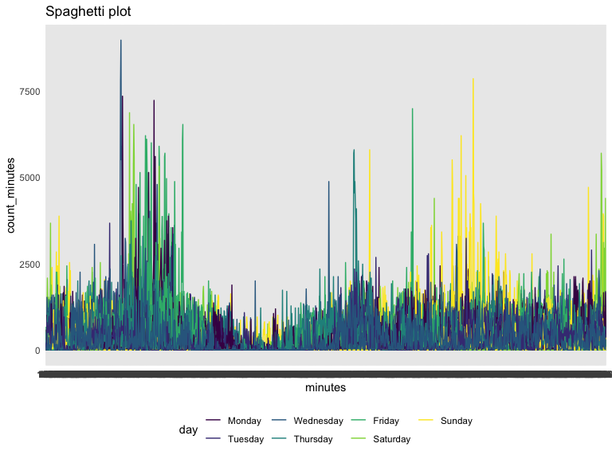

HW 3
================
Xing Chen
2019-10-12

# Problem 1

**import the dataset instacart**

``` r
data("instacart")

instacart %>% 
  group_by(department) %>% 
  summarize(n = n())
```

    ## # A tibble: 21 x 2
    ##    department           n
    ##    <chr>            <int>
    ##  1 alcohol           5598
    ##  2 babies           14941
    ##  3 bakery           48394
    ##  4 beverages       114046
    ##  5 breakfast        29500
    ##  6 bulk              1359
    ##  7 canned goods     46799
    ##  8 dairy eggs      217051
    ##  9 deli             44291
    ## 10 dry goods pasta  38713
    ## # … with 11 more rows

``` r
instacart %>% 
  group_by(department) %>% 
  summarize(
    mean_order_hour = mean(order_hour_of_day, na.rm = TRUE)
  )
```

    ## # A tibble: 21 x 2
    ##    department      mean_order_hour
    ##    <chr>                     <dbl>
    ##  1 alcohol                    13.7
    ##  2 babies                     13.5
    ##  3 bakery                     13.5
    ##  4 beverages                  13.5
    ##  5 breakfast                  13.5
    ##  6 bulk                       13.6
    ##  7 canned goods               13.6
    ##  8 dairy eggs                 13.6
    ##  9 deli                       13.6
    ## 10 dry goods pasta            13.7
    ## # … with 11 more rows

**Description**

There are 1384617 observations in the instacart dataset. Each row
represents a product from an order. There are 21 types of department in
this dataset and the mean order hour of the day is for each department
is around 13. The `aisle` variable represents the type of the goods that
are ordered and `order_day shows` the day of the week on which the order
is placed. For example, the first row in the dataset tells us yogurt was
ordered on Thursday and this product has been ordered by this person in
the past.

``` r
instacart %>% 
  group_by(aisle) %>% 
  summarize(items = n()) %>% 
  arrange(desc(items))
```

    ## # A tibble: 134 x 2
    ##    aisle                          items
    ##    <chr>                          <int>
    ##  1 fresh vegetables              150609
    ##  2 fresh fruits                  150473
    ##  3 packaged vegetables fruits     78493
    ##  4 yogurt                         55240
    ##  5 packaged cheese                41699
    ##  6 water seltzer sparkling water  36617
    ##  7 milk                           32644
    ##  8 chips pretzels                 31269
    ##  9 soy lactosefree                26240
    ## 10 bread                          23635
    ## # … with 124 more rows

There are 134 aisles exist and the most ordered item is fresh
vegetables.

**Create a plot**

``` r
instacart %>% 
  group_by(aisle) %>% 
  summarize(items = n()) %>% 
  filter(items > 10000) %>% 
  ggplot(aes(x = items, y = aisle)) + 
  geom_point() +
  labs(
    title = "number of items ordered in each aisle",
    x = "the number of items",
    y = "type of aisles",
    caption = "number of aisles larger than 10000 "
  )
```

<!-- -->

From the graph, fresh vegetables and fresh fruits are ordered much more
than other items. The ordered numbers of packaged vegetables fruits and
yogurt also stand out.

**Create a table**

``` r
instacart %>% 
  filter(
    aisle %in% c("baking ingredients", "dog food care", "packaged vegetables fruits")
  ) %>% 
  group_by(aisle, product_name) %>% 
  summarize(order_number = n()) %>% 
  arrange(desc(order_number)) %>% 
  filter(min_rank(desc(order_number)) < 4) %>% 
  knitr::kable()
```

| aisle                      | product\_name                                 | order\_number |
| :------------------------- | :-------------------------------------------- | ------------: |
| packaged vegetables fruits | Organic Baby Spinach                          |          9784 |
| packaged vegetables fruits | Organic Raspberries                           |          5546 |
| packaged vegetables fruits | Organic Blueberries                           |          4966 |
| baking ingredients         | Light Brown Sugar                             |           499 |
| baking ingredients         | Pure Baking Soda                              |           387 |
| baking ingredients         | Cane Sugar                                    |           336 |
| dog food care              | Snack Sticks Chicken & Rice Recipe Dog Treats |            30 |
| dog food care              | Organix Chicken & Brown Rice Recipe           |            28 |
| dog food care              | Small Dog Biscuits                            |            26 |

In packaged vegetables fruits aisle, organic baby spinach, organic
raspberries, and organic blueberries are the 3 most ordered items with
order number 9784, 5546, and 4966 respectively. In baking ingredients
aisle, light brown sugar, pure baking soda, and cane sugar are the 3
most ordered items with order number 499, 387, and 336 respectively. In
dog food care aisle, snack sticks chicken & rice recipe dog treats,
organix chicken & brown rice recipe, and small dog biscuits are the 3
most ordered items, with order number 30, 28, 26 respectively.

**Create a table**

``` r
instacart %>% 
  group_by(product_name, order_dow) %>% 
  filter(product_name %in% c("Pink Lady Apples", "Coffee Ice Cream")) %>% 
  summarize(
    mean_order_time = mean(order_hour_of_day, na.rm = TRUE)
  ) %>% 
  pivot_wider(
    names_from = order_dow,
    values_from = mean_order_time
  ) %>% 
  knitr::kable(digits = 2)
```

| product\_name    |     0 |     1 |     2 |     3 |     4 |     5 |     6 |
| :--------------- | ----: | ----: | ----: | ----: | ----: | ----: | ----: |
| Coffee Ice Cream | 13.77 | 14.32 | 15.38 | 15.32 | 15.22 | 12.26 | 13.83 |
| Pink Lady Apples | 13.44 | 11.36 | 11.70 | 14.25 | 11.55 | 12.78 | 11.94 |

For coffee ice cream, the mean order hour of a day for each day of the
week is 13.77, 14.32, 15.38, 15.32, 15.22, 12.26, 13.83. For pink lady
apples, the mean order hour of a day for each day of the week is 13.44,
11.36, 11.70, 14.25, 11.55, 12.78, 11.94.

# problem 2

## Data import and data cleaning

``` r
data("brfss_smart2010")

brfss_data = 
  brfss_smart2010 %>% 
  janitor::clean_names() %>% 
  filter(
    topic == "Overall Health", 
    response %in% c("Poor", "Fair", "Good", "Very good", "Excellent")
  ) %>% 
  mutate(
    response = factor(response),
    response = fct_relevel(response, "Poor", "Fair", "Good", "Very good", "Excellent")
  )
```

**Q1**

``` r
brfss_data %>% 
  filter(
    year %in% c(2002, 2010)
  ) %>% 
  group_by(year, locationabbr) %>% 
  summarize(
    unique_location = n_distinct(locationdesc)
  ) %>% 
  filter(unique_location > 6) %>% 
knitr::kable()
```

| year | locationabbr | unique\_location |
| ---: | :----------- | ---------------: |
| 2002 | CT           |                7 |
| 2002 | FL           |                7 |
| 2002 | MA           |                8 |
| 2002 | NC           |                7 |
| 2002 | NJ           |                8 |
| 2002 | PA           |               10 |
| 2010 | CA           |               12 |
| 2010 | CO           |                7 |
| 2010 | FL           |               41 |
| 2010 | MA           |                9 |
| 2010 | MD           |               12 |
| 2010 | NC           |               12 |
| 2010 | NE           |               10 |
| 2010 | NJ           |               19 |
| 2010 | NY           |                9 |
| 2010 | OH           |                8 |
| 2010 | PA           |                7 |
| 2010 | SC           |                7 |
| 2010 | TX           |               16 |
| 2010 | WA           |               10 |

In 2002, there are 6 states were observed at 7 or more places. In 2010,
there are 14 states were observed at 7 or more places.

**Q2**

``` r
brfss_excellent = 
  brfss_data %>% 
  filter(response == "Excellent") %>% 
  group_by(locationabbr, year) %>% 
  mutate(
    data_value_average = mean(data_value, na.rm = TRUE)) %>% 
  select(year, locationabbr, data_value_average) %>% 
  distinct()

brfss_excellent %>% 
  ggplot(aes(x = year, y = data_value_average, color = locationabbr)) +
  geom_line() +
  viridis::scale_color_viridis(
    name = "State", 
    discrete = TRUE
  ) +
  labs(
    title = "Spaghetti plot",
    y = "the average data value"
  ) +
  theme(legend.position = "right")
```

<!-- -->

The spaghetti plot is hard to read but a general decreasing trend can be
found when the year goes up.

**Q3**

``` r
brfss_data %>% 
  filter(year %in% c(2006, 2010), locationabbr == "NY") %>% 
  ggplot(aes(x = locationdesc, y = data_value, fill = response)) +
  geom_bar(stat = "identity", position = "fill") +
  facet_grid(~year) +
  coord_flip() +
  labs(
    title = "Ridges plot",
    x = "data values"
  )
```

<!-- -->

For the counties observed both in year 2006 and 2010. The distribution
of each responses doesn’t change much. That is the percentage for each
response doesn’t change significantly.

# Problem 3

## load and clean the data

``` r
accel_data = 
  read_csv(file = "./data/accel_data.csv") %>% 
  janitor::clean_names() %>% 
  mutate(
    day_type = ifelse(day %in% c("Saturday", "Sunday"), "weekend", "weekday"),
    day = forcats::fct_relevel(day, c("Monday", "Tuesday", "Wednesday", "Thursday", "Friday", "Saturday", "Sunday"))
  ) %>% 
  select(week, day_id, day, day_type, everything()) %>% 
  pivot_longer(
    activity_1:activity_1440,
    names_prefix = "activity_",
    names_to = "activity",
    values_to = "count_minutes"
  )
```

    ## Parsed with column specification:
    ## cols(
    ##   .default = col_double(),
    ##   day = col_character()
    ## )

    ## See spec(...) for full column specifications.

There are 50400 rows and 6 variables in this dataset. This resulting
dataset is in long format, transformed from a wide format.

## Create a table showing the total activity minutes in each day

``` r
accel_tidy_data = 
  accel_data %>% 
  group_by(day_id) %>% 
  mutate(
    total_activity = sum(count_minutes))

accel_tidy_data %>% 
  pivot_wider(
    names_from = "activity",
    values_from = "count_minutes"
  ) %>% 
  select(day_id, day, total_activity) %>% 
  knitr::kable()
```

| day\_id | day       | total\_activity |
| ------: | :-------- | --------------: |
|       1 | Friday    |       480542.62 |
|       2 | Monday    |        78828.07 |
|       3 | Saturday  |       376254.00 |
|       4 | Sunday    |       631105.00 |
|       5 | Thursday  |       355923.64 |
|       6 | Tuesday   |       307094.24 |
|       7 | Wednesday |       340115.01 |
|       8 | Friday    |       568839.00 |
|       9 | Monday    |       295431.00 |
|      10 | Saturday  |       607175.00 |
|      11 | Sunday    |       422018.00 |
|      12 | Thursday  |       474048.00 |
|      13 | Tuesday   |       423245.00 |
|      14 | Wednesday |       440962.00 |
|      15 | Friday    |       467420.00 |
|      16 | Monday    |       685910.00 |
|      17 | Saturday  |       382928.00 |
|      18 | Sunday    |       467052.00 |
|      19 | Thursday  |       371230.00 |
|      20 | Tuesday   |       381507.00 |
|      21 | Wednesday |       468869.00 |
|      22 | Friday    |       154049.00 |
|      23 | Monday    |       409450.00 |
|      24 | Saturday  |         1440.00 |
|      25 | Sunday    |       260617.00 |
|      26 | Thursday  |       340291.00 |
|      27 | Tuesday   |       319568.00 |
|      28 | Wednesday |       434460.00 |
|      29 | Friday    |       620860.00 |
|      30 | Monday    |       389080.00 |
|      31 | Saturday  |         1440.00 |
|      32 | Sunday    |       138421.00 |
|      33 | Thursday  |       549658.00 |
|      34 | Tuesday   |       367824.00 |
|      35 | Wednesday |       445366.00 |

Generally, the total activity were very high on Friday except one,
eventhough, it may not be the highest. The total activity for Wednesday
is relatively stable comepared to other days. As a whole, there is no
particular trend can be found.

## Create a sing panel plot to show the 24-hour activity time courses

``` r
accel_tidy_data %>% 
  ggplot(aes(x = activity, y = count_minutes, group = day_id, color = day)) +
  geom_line() 
```

<!-- -->

Across the 35 days observation, the count\_minutes fluctuate in a big
range and it is hard to see some detailed trends. But in overall, the
Wednesday’s count\_minute is lower than other days in a week in general
and Wednesday is also generally more stable than other days.
